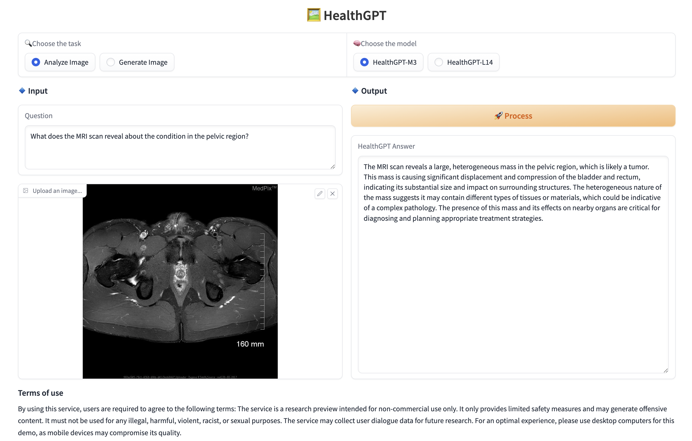

<h1 align = "center">

<em>HealthGPT</em> : A Medical Large Vision-Language Model for Unifying Comprehension and Generation via Heterogeneous Knowledge Adaptation
</h1>

<div align="center">
Tianwei Lin<sup>1</sup>, Wenqiao Zhang<sup>1</sup>, Sijing Li<sup>1</sup>, Yuqian Yuan<sup>1</sup>, Binhe Yu<sup>2</sup>, Haoyuan Li<sup>3</sup>, Wanggui He<sup>3</sup>, Hao Jiang<sup>3</sup>, 

Mengze Li<sup>4</sup>, Xiaohui Song<sup>1</sup>, Siliang Tang<sup>1</sup>, Jun Xiao<sup>1</sup>, Hui Lin<sup>1</sup>, Yueting Zhuang<sup>1</sup>, Beng Chin Ooi<sup>5</sup>
<br><br>

<sup>1</sup>Zhejiang University,
<sup>2</sup>University of Electronic Science and Technology of China,
<sup>3</sup>Alibaba,
<sup>4</sup>The Hong Kong University of Science and Technology,
<sup>5</sup>National University of Singapore

<a href='https://arxiv.org/abs/2502.09838'></a> 
<a href='https://huggingface.co/lintw/HealthGPT-M3'></a>
<a href='https://huggingface.co/datasets/lintw/VL-Health'></a>
<a href='https://llsuzy.github.io/HealthGPT.github.io/'></a>
<a href='https://www.youtube.com/watch?v=UtusB3L2msk'></a>
</div>


## 🌟 Overview
Welcome to **HealthGPT!** 🚀
**HealthGPT** is an advanced medical Large Vision-Language Model with a unified framework that integrates both medical visual comprehension and generation capabilities. In this project, a **heterogeneous low rank adaptation (H-LoRA)** and a **three-stage learning strategy** are proposed, enabling the pre-trained large language model to efficiently follow both visual comprehension and generation instructions.

# 🔥 News
- **[2025.03.06]** We have released the VL-Health Dataset.
- **[2025.02.26]** We have released the UI/UX for the inference.
- **[2025.02.17]** We have released the pre-trained weight on HuggingFace and inference script.
### TODO
- [x] Release inference code.
- [x] Release the pre-trained weight of the model.
- [x] Release the inference UI/UX.
- [x] Release VL-Health dataset.
- [ ] Release training scripts.
- [ ] Construct the website.

### 📚 Task Classification and Support
**HealthGPT** supports **7** types of medical comprehension tasks and **5** types of medical generation tasks, outperforming recent unified visual models and medical-specific models.
<p align="center">
  
</p>

### 🏗️ Architecture
The HealthGPT architecture integrates **hierarchical visual perception** and **H-LoRA**, employing a task-specific hard router to select visual features and H-LoRA plugins, generating text and vision outputs with an autoregressive manner.
<p align="center">
  
</p>

## 🛠️ Getting Started
We have released our model in two configurations, **HealthGPT-M3** and **HealthGPT-L14**, to suit different requirements and resource availability:
- HealthGPT-M3: A smaller version optimized for speed and reduced memory usage.
- HealthGPT-L14: A larger version designed for higher Performance and more complex tasks.

### Installation
**1. Prepare Environment**

First, clone our repository and create the Python environment for running HealthGPT using the following command:
```
# clone our project
git clone https://github.com/DCDmllm/HealthGPT.git
cd HealthGPT

# prepare python environment
conda create -n HealthGPT python=3.10
conda activate HealthGPT
pip install -r requirements.txt
```

**2. Prepare Pre-trained Weights**

HealthGPT utilizes `clip-vit-large-patch14-336` as the visual encoder and employs `Phi-3-mini-4k-instruct` and `phi-4` as the pre-trained LLM base models for HealthGPT-M3 and HealthGPT-L14, respectively. Please download the corresponding weights:
|Model Type|Model Name|Download|
|:-:|:-:|:-:|
|ViT|`clip-vit-large-patch14-336`|[Download](https://huggingface.co/openai/clip-vit-large-patch14-336)|
|Base Model (HealthGPT-M3)|`Phi-3-mini-4k-instruct`|[Download](https://huggingface.co/microsoft/Phi-3-mini-4k-instruct)|
|Base Model (HealthGPT-L14)|`phi-4`|[Download](https://huggingface.co/microsoft/phi-4)|

For medical vision generation tasks, please follow the [official VQGAN guide](https://github.com/CompVis/taming-transformers) and download the `VQGAN OpenImages (f=8), 8192` model weights from the `"Overview of pretrained models"` section. Below is the direct link to the corresponding VQGAN pre-trained weights:
|Model Name|Download|
|:-:|:-:|
|VQGAN OpenImages (f=8), 8192, GumbelQuantization|[Download](https://heibox.uni-heidelberg.de/d/2e5662443a6b4307b470/?p=%2F&mode=list)|

After downloading, place the `last.ckpt` and `model.yaml` files in the `taming_transformers/ckpt` directory.

**3. Prepare H-LoRA and Adapter Weights**

HealthGPT enhances the base model's capabilities for medical visual comprehension and generation by training a small number of H-LoRA parameters and adapter layers for aligning vision and text. We have currently released some weights from the training process, supporting `medical visual question answering` and `open-world visual reconstruction` tasks. Here are the corresponding weights: [Download](https://huggingface.co/lintw/HealthGPT-M3).

We will soon be releasing the full weights for HealthGPT-L14, along with the H-LoRA weights for medical generation tasks. Stay tuned!!!

## ⚡ Inference
### Medical Visual Question Answering

To perform inference using HealthGPT, please follow these steps:

1. Download Necessary Files:
    - Ensure you have downloaded all the required model weights and resources.
2. Update Script Paths:
    - Open the script located at `llava/demo/com_infer.sh`.
    - Modify the following variables to point to the paths where you stored the downloaded files:
        - MODEL_NAME_OR_PATH: Path or identifier for base model.
        - VIT_PATH: Path to the Vision Transformer model weights.
        - HLORA_PATH: Path to the [HLORA weights](https://huggingface.co/lintw/HealthGPT-M3/blob/main/com_hlora_weights.bin) file for visual comprehension.
        - FUSION_LAYER_PATH: Path to your [fusion layer weights](https://huggingface.co/lintw/HealthGPT-M3/blob/main/fusion_layer_weights.bin) file.
3. Run the Script:
    - Execute the script in your terminal to begin inference:
        ```
        cd llava/demo
        bash com_infer.sh
        ```

You can directly run the Python command in your terminal by specifying the paths and parameters. This approach allows you to easily change the image or question as needed:
```
python3 com_infer.py \
    --model_name_or_path "microsoft/Phi-3-mini-4k-instruct" \
    --dtype "FP16" \
    --hlora_r "64" \
    --hlora_alpha "128" \
    --hlora_nums "4" \
    --vq_idx_nums "8192" \
    --instruct_template "phi3_instruct" \
    --vit_path "openai/clip-vit-large-patch14-336/" \
    --hlora_path "path/to/your/local/com_hlora_weights.bin" \
    --fusion_layer_path "path/to/your/local/fusion_layer_weights.bin" \
    --question "Your question" \
    --img_path "path/to/image.jpg"

```

- Customize the Question and Image: You can modify the `--question` and `--img_path` parameters to ask different questions or analyze different images.

Correspondingly, the visual Question Answering task of `HealthGPT-L14` can be executed with the following Python command:
```
python3 com_infer_phi4.py \
    --model_name_or_path "microsoft/Phi-4" \
    --dtype "FP16" \
    --hlora_r "32" \
    --hlora_alpha "64" \
    --hlora_nums "4" \
    --vq_idx_nums "8192" \
    --instruct_template "phi4_instruct" \
    --vit_path "openai/clip-vit-large-patch14-336/" \
    --hlora_path "path/to/your/local/com_hlora_weights_phi4.bin" \
    --question "Your question" \
    --img_path "path/to/image.jpg"

```
The weights of `com_hlora_weights_phi4.bin` can be downloaded [here](https://huggingface.co/lintw/HealthGPT-L14).

### Image Reconstruction
Similarly, simply set the `HLORA_PATH` to point to the [`gen_hlora_weights.bin`](https://huggingface.co/lintw/HealthGPT-M3/blob/main/gen_hlora_weights.bin) file and configure the other model paths. Then, you can perform the image reconstruction task using the following script:
```
cd llava/demo
bash gen_infer.sh
```

You can also directly execute the following python command:
```
python3 gen_infer.py \
    --model_name_or_path "microsoft/Phi-3-mini-4k-instruct" \
    --dtype "FP16" \
    --hlora_r "256" \
    --hlora_alpha "512" \
    --hlora_nums "4" \
    --vq_idx_nums "8192" \
    --instruct_template "phi3_instruct" \
    --vit_path "openai/clip-vit-large-patch14-336/" \
    --hlora_path "path/to/your/local/gen_hlora_weights.bin" \
    --fusion_layer_path "path/to/your/local/fusion_layer_weights.bin" \
    --question "Reconstruct the image." \
    --img_path "path/to/image.jpg" \
    --save_path "path/to/save.jpg"

```

## 🧠 Prompting System

HealthGPT uses a structured prompting system designed specifically for medical image analysis. This system guides the model to perform systematic analysis across various medical imaging modalities.

### Core Capabilities

HealthGPT excels at:

1. **Comprehensive Modality Identification**
   - Accurately identifies X-ray, CT, MRI, ultrasound and other imaging modalities
   - Recognizes specialized protocols (contrast-enhanced, T1/T2-weighted, etc.)

2. **Anatomical Analysis**
   - Systematically describes visible anatomical structures with medical precision
   - Evaluates position, shape, size, and density/intensity of all visible organs

3. **Abnormality Detection**
   - Identifies positional, structural, and appearance abnormalities
   - Recognizes congenital anomalies, developmental variants, and pathologies
   - Detects masses, fluid collections, calcifications, and other significant findings

4. **Relational Assessment**
   - Analyzes vascular structures and their relationships to organs
   - Evaluates symmetry/asymmetry of paired structures
   - Identifies spatial relationships between anatomical structures

5. **Image Enhancement and Reconstruction**
   - Reconstructs medical images with enhanced clarity
   - Highlights anatomical abnormalities and pathological findings
   - Preserves and emphasizes clinically relevant details

### Prompting Structure

To get optimal results from HealthGPT, structure your prompts following these guidelines:

#### For Comprehension Tasks:

```
Analyze this medical image. Identify the imaging modality, describe visible 
anatomical structures, and note any abnormalities, congenital variations, 
or developmental anomalies. Include observations about organ position, 
shape, and symmetry.
```

#### For Generation/Enhancement Tasks:

```
Reconstruct this medical image with enhanced clarity. Highlight any anatomical 
abnormalities, congenital variations, or pathological findings. Pay special 
attention to organ position, structural relationships, and any asymmetries.
```

### Model-Specific Instruction Templates

HealthGPT uses different instruction templates depending on the underlying model:

#### Phi-3 Template:
The model uses a comprehensive system prompt that guides it through a 10-step analysis process:
1. Identifying the imaging modality
2. Describing anatomical regions
3. Noting position, shape, size, and density/intensity
4. Identifying abnormalities
5. Looking for pathological signs
6. Commenting on congenital anomalies
7. Describing vascular structures
8. Assessing symmetry
9. Considering possible diagnoses
10. Suggesting additional tests

#### Phi-4 Template:
Similar to Phi-3 but adapted for the enhanced capabilities of Phi-4, with additional emphasis on:
- More detailed anatomical relationships
- Higher precision in identifying subtle abnormalities
- Enhanced diagnostic reasoning

### Where HealthGPT Excels

HealthGPT particularly excels in:

1. **Kidney and Urinary Tract Imaging**
   - Identifying horseshoe kidneys and other congenital variations
   - Detecting nephrolithiasis, hydronephrosis, and masses
   - Recognizing anomalies in the collecting system

2. **Chest Imaging**
   - Analyzing pulmonary nodules and infiltrates
   - Evaluating cardiac silhouette and mediastinum
   - Identifying pleural effusions and pneumothorax

3. **Neuroimaging**
   - Detecting intracranial hemorrhage and masses
   - Identifying infarcts and white matter changes
   - Analyzing ventricular size and symmetry

4. **Abdominal Imaging**
   - Comprehensive liver assessment
   - Pancreatic and biliary evaluation
   - Detection of free fluid and masses

5. **Musculoskeletal Analysis**
   - Fracture detection and classification
   - Joint space evaluation
   - Bone density assessment

These capabilities are enabled by HealthGPT's training on diverse medical datasets and its specialized architecture combining visual perception with medical knowledge.

### Using v0-Style Prompt Files

We've created a structured prompting system inspired by v0.dev that separates prompts into specialized files for greater clarity and flexibility. These files can be found in the root directory:

1. **medical0.txt**: Core instructions for the medical analysis system
   - Contains the 10-step analysis protocol
   - Defines expected response format
   - Sets ethical guidelines

2. **medical0.model.txt**: Model-specific details
   - Describes differences between Phi-3 and Phi-4 models
   - Contains technical parameters for each model variant
   - Lists model limitations and capabilities

3. **medical0.tools.txt**: Detailed analysis tools and capabilities
   - Describes specialized analysis capabilities for different body systems
   - Provides example prompts for different analysis tasks
   - Documents image enhancement and reconstruction capabilities

#### Implementation Options

You can implement these structured prompts in your HealthGPT system in two ways:

1. **Direct Integration**: Load the full prompts directly into the conversation templates:
   ```python
   # Example integration in conversation.py
   with open("medical0.txt", "r") as f:
       system_prompt = f.read()
   
   conv_phi3_instruct = Conversation(
       system=system_prompt,
       roles=("\n<|user|>\n", "\n<|assistant|>\n"),
       # ... other parameters
   )
   ```

2. **Script-Based Approach**: Keep the current implementation with long prompts in conversation.py and shorter versions in scripts, using the structured files as reference documentation.

The v0-style prompting approach helps standardize outputs, ensures comprehensive analysis, and makes the system more maintainable as capabilities evolve.

## Server

**An interactive Chat UI based on Gradio, supporting text + image input, and returning text or images according to different modes.**

### 📌 Project Introduction
This project is a **Gradio** front-end interface, supporting users:
- **Analyze image (comprehension task)**: input text + image, output **text**
- **Generate image (generation task)**: input text + image, output **image**

### 📦 Installation Dependencies
This project runs based on Python, and requires the installation of `Gradio` and `Pillow`.

```bash
pip install gradio pillow
```

### ▶️ Run the project
Run the following command in the terminal:

```bash
python app.py
```
After running, the terminal will output the Gradio access address (such as http://127.0.0.1:5010), which can be opened in the browser for use.

<p align="center">
  
</p>


## 🔗 Citation
If you found this work useful, please consider giving this repository a star and citing our paper as followed:
```
@misc{lin2025healthgptmedicallargevisionlanguage,
      title={HealthGPT: A Medical Large Vision-Language Model for Unifying Comprehension and Generation via Heterogeneous Knowledge Adaptation}, 
      author={Tianwei Lin and Wenqiao Zhang and Sijing Li and Yuqian Yuan and Binhe Yu and Haoyuan Li and Wanggui He and Hao Jiang and Mengze Li and Xiaohui Song and Siliang Tang and Jun Xiao and Hui Lin and Yueting Zhuang and Beng Chin Ooi},
      year={2025},
      eprint={2502.09838},
      archivePrefix={arXiv},
      primaryClass={cs.CV},
      url={https://arxiv.org/abs/2502.09838}, 
}
```

## 🤝 Acknowledgment
Our project is developed based on the following repositories:
- [LLaVA](https://github.com/haotian-liu/LLaVA): Large Language and Vision Assistant
- [LLaVA++](https://github.com/mbzuai-oryx/LLaVA-pp): Extending Visual Capabilities with LLaMA-3 and Phi-3
- [Taming Transformers](https://github.com/CompVis/taming-transformers): Taming Transformers for High-Resolution Image Synthesis

## ⚖️ License
This repository is under [Apache License 2.0](LICENSE).
